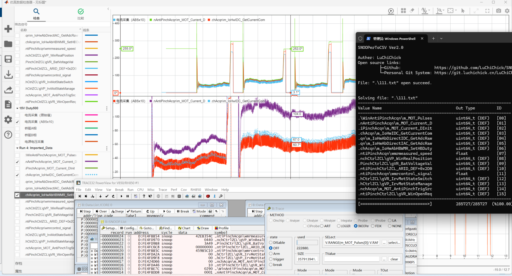

## 这是个啥  

`SNOOPerToCSV` 是用于将劳特巴赫 `TRACE32-SNOOPer` 录制的数据转换为CSV表格的工具，你可以很方便地通过本工具快速将`SNOOPer`录制的变量数据导出为CSV表格，并便捷地调整数据输出格式、时间轴等；  

配合示波器和MatLab，可以很方便的实现对轴波形分析，方便运行时数据采集：


## 如何使用

它是一个非GUI程序，所以你需要使用终端来调用它，使用如下指令即可进行基础的数据转换：  

```shell
SNOOPerToCSV.exe <file1> <file2> ...
```

只需要提供要处理的文件，本工具即可按照默认的时间轴及类型配置依次处理文件，默认的时间轴从0.00s开始，而配置的默认输出格式为无符号整型，如果你希望修改输出的格式和时间轴，可以通过添加如下参数实现：

```shell
1.  -f <identification> <type>      指定特定标识的数据条目输出为特定类型
2.  -t <time(s)>                    指定时间轴起始
```

例如我想将 `AAA.txt` 文件以 `-1.2s` 为时间轴起始，并将名称中含有 `Voltage` 的条目以单浮点类型输出，可以使用以下指令：

```shell
SNOOPerToCSV.exe AAA.txt -t -1.2 -f Voltage float
```

`<identification>` 标识变量的方式，除了上述的子串名识别外，还可以使用ID进行匹配，这个ID会在你进行生成时输出到终端，例如上面的图片终端中有16个ID（劳特巴赫至多支持16个变量采样），此外也可以使用识别串同时指定多个变量，例如将名称中含有 `Voltage` 的条目和ID为11的条目输出为单浮点类型，你可以使用如下指令：

```shell
SNOOPerToCSV.exe AAA.txt -t -1.2 -f Voltage,11 float
```

即所谓识别串就是将子串名或ID以逗号（英文逗号）分隔的连续字符串作为 `<identification>` 输入；  

要注意的是 `Voltage,15,` 这个识别串是非法的，末尾的逗号需要去掉；

在有多个文件输入时，ID匹配仅识别第一个文件中的条目，随后程序会记住这个ID对应的条目名称，在下个文件时识别记忆的条目名而非再次以ID进行识别，避免了劳特巴赫输出顺序导致的批量文件处理过程中数据格式错误；

当ID与子串名同时指定了一个条目时，子串名的优先级要高于ID；

## 关于构建
本仓库所使用的构建平台及环境为如下:  
	OS：Windows11 Professional 24H2 (26100.4652)  
	Tool Chain：[mingw-w64\i686-14.2.0-release-win32-dwarf-ucrt-rt_v12-rev2](https://github.com/niXman/mingw-builds-binaries/releases/tag/14.2.0-rt_v12-rev2)  

构建关系由 `Makefile` 组织，使用 `C17`、`C++17` 标准，但由于并未使用高级特性，构建标准可自行调整；  
完善构建环境后，在工作目录下使用 `make`、`mingw32-make` 即可进行构建；  

本工具仅使用标准库，完全具备跨平台支持，但在其他平台、环境下需要对 `Makefile` 进行少量修改；  

## 主要目录及说明
    Git-Storage        本仓库目录
        ├─.vscode           用于vscode的配置文件
	    │   ├─c_cpp_properties.json    VsCode感知引擎配置（需要C/C++插件）
	    │   ├─launch.json              VsCode调试运行配置（需要C/C++插件）
        │   └─tasks.json               VsCode预构建脚本
        ├─Inc               头文件
        │   └─(...)
        ├─Src               源文件
        │   └─(...)
        ├─Img               本仓库的图片资源文件
        │   └─(...)
        ├─Test              测试用文件
        │   └─Lauterbach-SNOOPer.txt             测试用文件，SNOOPer输出
        ├─.gitignore        仓库忽略文件
        └─Makefile          编译构建所用的Makefile


